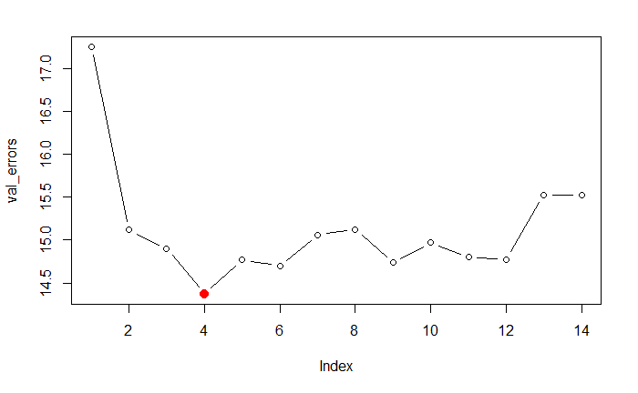
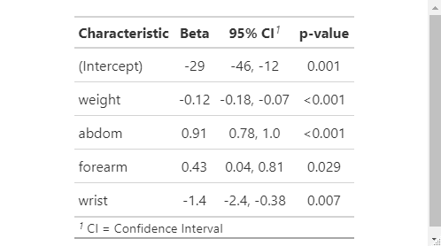

# Analysis on Body Fat

With the fat dataset in the library(faraway), the objective for this analysis is to fit a linear model to predict body fat (variable brozek) using the other variables available, except for siri (another way of computing body fat), density (it is used in the brozek and siri formulas) and free (it is computed using brozek formula).

Additionally, the modeling is assumed to meet the assumptions for linear regression and will not be assessed within this project.

## Data

The data set contains several physical measurements of 252 males. Most of the variables can be measured with a scale or tape measure. 

Data frame with 252 observations on the following 19 variables.

>The data were supplied by Dr. A. Garth Fisher, Human Performance Research Center, Brigham Young University, Provo, Utah 84602, who gave permission to freely distribute the data and use them for non-commercial purposes. 

### Variables:

* brozek – Percent body fat using Brozek’s equation, 457/Density - 414.2
* siri – Percent body fat using Siri’s equation, 495/Density - 450
* density – Density (gm/cm^2)
* age – Age (yrs)
* weight – Weight (lbs)
* height – Height (inches)
* adipos – BMI Adiposity index = Weight/Height^2 (kg/m^2)
* free – Fat Free Weight = (1 - fraction of body fat) * Weight, using Brozek’s formula (lbs)
* neck – Neck circumference (cm)
* chest – Chest circumference (cm)
* abdom – Abdomen circumference (cm) “at the umbilicus and level with the iliac crest”
* hip – Hip circumference (cm)
* dthigh – Thigh circumference (cm)
* knee – Knee circumference (cm)
* ankle – Ankle circumference (cm)
* biceps – Extended biceps circumference (cm)
* forearm – Forearm circumference (cm)
* wrist – Wrist circumference (cm) “distal to the styloid processes”

## Methods Tested:
* Ordinary Least Squares (OLS) - Baseline
* Best Subsets $R^2$, Adjusted $R^2$, $C_p$, and BIC
* Best Subsets with Cross-Validation
* Leave-One-Out Cross-Validation
* L1 - Lasso
* L2 - Ridge
* Principal Component Regression (PCR)
* Partial Least Squares (PLS)

## Best Model

Based on calculated test MSE, it appears that best subsets cross validation works the best from all the methods used with the given seed. 

The plot depicts how many parameters should be used based on the model with the smallest error value.

The model estimated by our linear regression is thus:

> brozek ~ -2.9 - 0.12[weight] + 0.91[abdom] + 0.43[forearm] - 1.4[wrist]

Additional information for the model's parameters can be seen in the below table.

